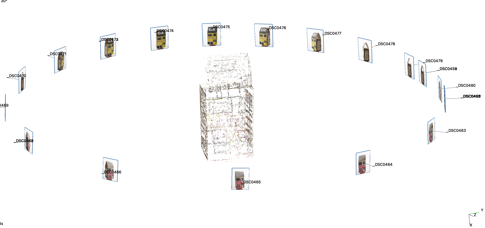
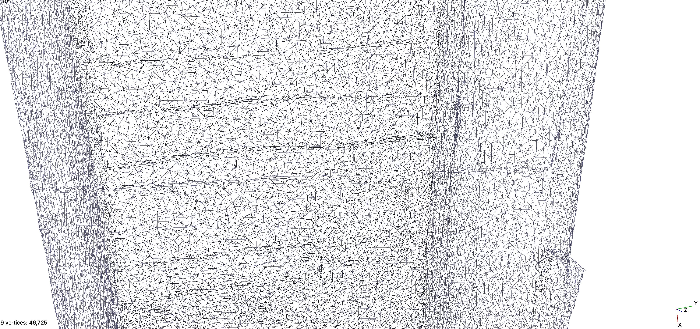

:::::::::::::::::::::::::::::::::::::: questions 

- Introduces the underlying methods used by the photogrammetry software. 
- This helps to understand the best practices to photograph objects and environments.

:::::::::::::::::::::::::::::::::::::::::::::::::

To generate a photogrammetric model, we might choose to overlook the concepts and formulas utilised within the software to produce such a model. 

Yet, understanding its functioning can be highly beneficial. Such understanding enables us to evaluate the feasibility of successfully acquiring objects and identify strategies to enhance our chances of success.

## Basic steps 

The basic steps of photogrammetric processing are: 

1. Feature detection
2. Feature matching
3. Structure reconstruction

## Feature detection
Features are "interest points" or "key points" in an image. 

The goal of this step is to find points which are repeatable and distinctive.

Corners and other distinctive patterns in the image are obvious features to consider.

](fig/sift1.png){alt="sift algorithm" width="60%"}

::::: challenge
 
## Challenge: Try it yourself

Which points would you choose in this image of a building?

](fig/Edifice_Shaughnessy.jpg){alt="building" width="60%"}

Why?

::::: 

::::: challenge
 
## Challenge: Try it yourself

Which points would you choose in this image of a vase?

](fig/Vase_MET_45484.jpg){alt="vase" width="60%"}

What makes this image different from the one before?
::::: 

::::: challenge

## Challenge: Try it yourself

Which points would you choose in this image of a silver mug?

](fig/Mug_Adrian_Bancker.jpg){alt="mugs" width="60%"}

Does this share the same challenges with any of the images
above?
:::::

## Feature matching
The goal of this step is to find correspondences 
of features across different views. 

The software will attempt to match features in two or more images, ideally seeking a reliable outcome. 
We want a reliable result.

{alt="Features matched" width="60%"}

::::: challenge

## Challenge: Try it yourself
Do the features below correspond with each other?

{alt="hosue match" width="100%"}

::::: 
 

## Structure reconstruction

Taking into account all identified features in a 
pair of images,
the software builds a projection of the points 
in 3D space by using the camera position.

](fig/Epipolar_Geometry1.svg){alt="projection" width="100%"}

The scene is incrementally extended by adding new images and triangulating new points. 

{alt="point cloud" width="100%"}

A much denser set of features is produced.
The output of this process is a **point cloud** or a collection of points. 

{alt="dense point cloud" width="100%"}

The 3D model is created using what is know as triangulation. This process creates a 3D model with thousands or millions of triangles. 

{alt="triangulated model" width="100%"}

{alt="triangulated model" width="60%"}

The texture is then mapped to this surface.

:::: challenge

## Challenge: What does this all mean for me?

Based on what you have seen, 
reflect on what are the 
key things to consider when selecting objects for photogrammetry. 

Which of the objects you work with would be the best candidates for photogrammetry and which would not be ideal? 

::::

## Acquisition tips

- Capture images with good texture.
- Avoid completely texture-less, transparent and reflective images. The computer will have difficulty finding and matching features.
- If the scene does not contain enough texture itself, you could place additional background objects, such as posters, newspapers, small objects etc. 

 

